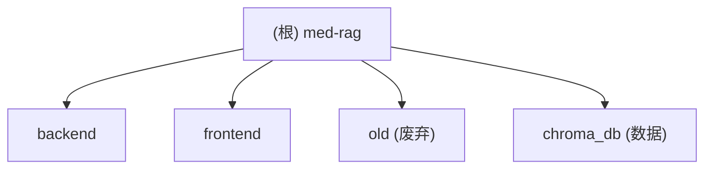

# NHC Medical RAG - 卫健委诊疗指南智能问答系统

## 变更记录 (Changelog)

| 时间 | 操作 | 说明 |
|------|------|------|
| 2026-03-31 21:17:53 | 初始化生成 | 首次全仓扫描，生成根级与模块级 CLAUDE.md |

---

## 项目愿景

基于卫健委诊疗指南 PDF 文档，构建 RAG（检索增强生成）问答系统。用户通过 Web 界面提出医学问题，后端从向量数据库中检索相关指南片段，结合大语言模型（Claude / Qwen）生成通俗易懂、有温度的医学科普回答，所有回答严格溯源至指南原文。

---

## 架构总览

- **架构模式**: 前后端分离 + Docker Compose 编排
- **后端**: Python FastAPI，提供 RAG 聊天 API（SSE 流式输出）
- **前端**: React 18 SPA，Dark Glassmorphism 风格 UI
- **向量存储**: ChromaDB（持久化本地存储）
- **Embedding**: DashScope `text-embedding-v3`（1024 维）
- **LLM**: Claude Sonnet（通过 yunwu.ai 代理），备选 Qwen-Max（通过 DashScope）
- **反向代理**: Nginx，前端静态文件 + API 代理
- **部署**: Docker Compose（backend + frontend 两个服务）

---

## 模块结构图



---

## 模块索引

| 模块 | 路径 | 语言 | 职责 |
|------|------|------|------|
| backend | `backend/` | Python | FastAPI RAG 服务：PDF 数据摄入、向量检索、多轮会话聊天（SSE 流式） |
| frontend | `frontend/` | JavaScript (React) | 用户界面：聊天对话、Markdown 渲染、引用来源展示 |
| old | `old/` | JavaScript | 旧版前端代码（已废弃），使用 Qwen 模型，无 Markdown 渲染库 |
| chroma_db | `chroma_db/` | 二进制数据 | ChromaDB 持久化向量数据，存储指南 embedding |

---

## 运行与开发

### 环境变量

根目录 `.env` 文件包含：
- `DASHSCOPE_API_KEY` - 阿里云 DashScope API 密钥（用于 Embedding + 备选 LLM）
- `ANTHROPIC_API_KEY` - Anthropic API 密钥（通过 yunwu.ai 代理访问 Claude）

### 本地开发

```bash
# 后端（需要 Python 环境 + 依赖）
cd backend
python main.py          # 启动 FastAPI，端口 8000

# 前端（需要 Node.js）
cd frontend
npm install
npm start               # 启动开发服务器
```

### Docker 部署

```bash
docker-compose up --build        # 生产构建
docker-compose up -f docker-compose.override.yml  # 开发覆盖（端口 8080:80）
```

- 生产模式：前端 Nginx 监听 80 端口，API 代理到 backend:8000
- 开发覆盖：前端映射 8080:80，后端挂载本地代码

### 数据摄入

```bash
# 将 PDF 文件放入 /app/pdfs/nhc-guidelines/（Docker 内）或 /tmp/nhc-guidelines（Docker Volume）
python backend/ingest.py         # 执行 PDF -> 向量化管线
```

---

## API 端点

| 方法 | 路径 | 说明 |
|------|------|------|
| POST | `/api/chat` | RAG 聊天（SSE 流式），参数: `question`, `top_k`, `session_id` |
| DELETE | `/api/session/{session_id}` | 清除会话记忆 |
| GET | `/api/session/{session_id}/summary` | 获取会话摘要 |
| GET | `/api/stats` | 向量库统计（chunk 数、来源列表） |
| GET | `/api/health` | 健康检查 |

---

## 测试策略

当前项目**没有测试文件**。`frontend/package.json` 中声明了 `react-scripts test` 脚本但未发现任何测试用例。后端无测试目录或测试文件。

---

## 编码规范

- **后端**: Python，使用 Pydantic 数据模型，FastAPI 异步路由，线程池做后台摘要
- **前端**: React 函数组件 + Hooks，使用 ReactMarkdown 渲染，CSS 变量主题系统
- **UI 风格**: Dark Glassmorphism（深色毛玻璃），Inter 字体，紫色主色调
- **注释语言**: 中英混合，关键业务逻辑用中文注释

---

## AI 使用指引

- 本项目是 RAG 应用，修改 LLM 相关代码时注意 `SYSTEM_PROMPT` 的严格指南遵循要求
- 后端同时初始化了同步 `OpenAI` 客户端（DashScope）和异步 `AsyncOpenAI` 客户端（yunwu.ai 代理），注意区分用途
- `main.py.bak` 是旧版（使用 Qwen-Max，非流式），当前版本 `main.py` 使用 Claude + SSE 流式
- 会话状态存储在内存中（`_session_store`），服务重启会丢失
- 前端 SSE 解析逻辑在 `app.js` 的 `sendMessage` 函数中，按 `\n\n` 分帧
